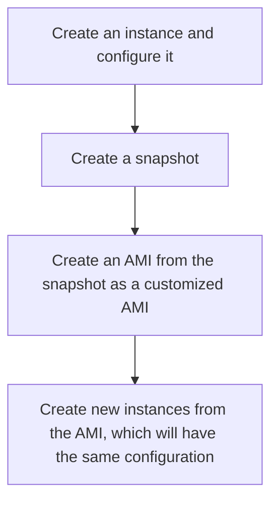

### Amazon EC2
- EC2 instance is a virtual server
- on Windows, Linux, or MacOS
- EC2 hosts are managed by AWS
- instance type: CPU, memory, storage and networking

#### Launching an EC2 Instance
- An **AMI** defines configuration of the instance
- AMI is created from an EBS **snapshot**
- An EBS **snapshot** is a point-in-time backup of an instance
- Flow:

- Related security and network resources
    - **Security Group** controls inbound & outbound traffic
    - **Internet Gateway** (VPC level) enables access to/from the Internet

#### Benifits of Amazon EC2
* Elastic computing
* Complete control
* Flexible
- AWS CLI configured with access keys
- Access keys is associated with an IAM user
- The Access key uses permissions assigned to the IAM user, i.e. access S3.
- Downside:  stored in the file system of EC2 instances, insecure.
- **Instance profile**: a way to connect an IAM role to an EC2 instance
    - The role is assumed by the EC2 instance
    - The instance gains access to resources that the role is permitted.
* Reliable
* Secure - Fully integrated with VPC and security features
* Inexpensive
#### EC2 user data and Metadata
- **user data** is run when the instance starts for the first time
- **Metadata** is data about the EC2 instance
    * http://169.254.169.254/latest/meta-data
#### Access keys
- AWS CLI configured with access keys
- Access keys is associated with an IAM user
- The Access key uses permissions assigned to the IAM user, i.e. access S3.
- Downside:  stored in the file system of EC2 instances, insecure.
- **Instance profile**: a way to connect an IAM role to an EC2 instance
    - The role is assumed by the EC2 instance
    - The instance gains access to resources that the role is permitted.
#### EC2 placement groups
- Cluster: **low-latency**, **tightly-coulped** **HPC application**, **high throughput** network traffic
- Partition: spread instances across partitions. Instances in one partition do not share the underlying hardware with instances in different partition. Used by **distributed and replicated workloads** i.e Hadoop, Cassandra, Kafka.
- Spread: **all** instances are on **different** hardwares
#### Network Interfaces (ENI, ENA, EFA)
##### Elastic Network Interface (ENI)
* Basic adapter for normal requirement
* Can use with all instance types
##### Elastic Network Adapter (ENA)
* Enahnced network performance
* Higher bandwidth, lower inter-instance latency
* Must choose supported instance types
##### Elastic Fabric Adapter (EFA)
* HPC, MPI, ML use cases
* Tightly coupled applications
* Can use with all instance types

#### Public, Private and Elastic IP Addresses
##### Public IP address
* Lost when instance stopped
* Used in public subnet
* No charge
* Associated with a private IP address on an instance
* Cannot be moved between instances
##### Private IP address
* Retain when instance stopped
* Used in public & private subnets
##### Elastic IP address
* Static public IP address
* Charged if not used
* Associated with a private IP address on the instance
* can be moved between instances and Elastic Network adapters

#### NAT for Public Addresses
From an EC2 instance having a public IP address, using the CLI in the instance i.e. *ip addr show eth0* doesn't show the **public** IP address, it only shows the **private** ip address. The instance doesn't know anything about the public IP address. The reason is the public ip address is actually associated to the **network adapter**. The **Internet Gateway** actually perform the **NAT**.

#### Private Subnets and Bastion Hosts
A EC2 instance having no a public IP address and defined in a private subnet is not accessiable from internet.
We can ssh to an instance having a public IP defined in a public subnet. Then ssh from that instance to the instance in the private subnet. Here the instance in the public subnet is used as something we call a **bastion host** or **jump host**.
